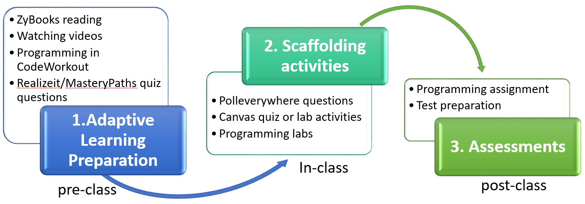

# ITSC 2214: Data Structures and Algorithms (3 credits)

|                |                                               |
| -------------- | --------------------------------------------- |
| Instructor     | Dhruv Hemang Dhamani                          |
| Email          | ddhamani@uncc.edu                             |
| Phone          | (980) 337-9788                                |
| Office Hours   | Monday through Friday 2 pm - 3:30 pm (Online) |
| Communications | Zulip (Prefered) or Email/Text (Backup)       |

## Tables of Contents

- [ITSC 2214: Data Structures and Algorithms (3 credits)](#itsc-2214-data-structures-and-algorithms-3-credits)
  - [Tables of Contents](#tables-of-contents)
  - [Course Description](#course-description)
  - [Pre or Co-requisite](#pre-or-co-requisite)
  - [Course Objectives](#course-objectives)
  - [Policy for change in Syllabus](#policy-for-change-in-syllabus)
  - [Required Materials](#required-materials)
  - [Supplemental Textbook](#supplemental-textbook)
  - [Web Resources](#web-resources)
  - [Course Format and Expections](#course-format-and-expections)
    - [Online Course Format before Oct. 1](#online-course-format-before-oct-1)
    - [Hybrid Course format after Oct. 1](#hybrid-course-format-after-oct-1)
    - [Modular Learning Cycle](#modular-learning-cycle)
    - [Course Activities](#course-activities)
  - [Grading Scheme](#grading-scheme)
  - [Grading scale](#grading-scale)
  - [Topic outline](#topic-outline)
  - [General Course Policies](#general-course-policies)
    - [COVID-19 Protection](#covid-19-protection)
    - [COVID-19 Niner Health Check](#covid-19-niner-health-check)
    - [Recording in the classroom:](#recording-in-the-classroom)
    - [Classroom conduct](#classroom-conduct)
    - [Attendance](#attendance)
    - [Preparation for Class](#preparation-for-class)
    - [Communication Policy](#communication-policy)
    - [Late Submissions](#late-submissions)
    - [Basic Needs Security](#basic-needs-security)
    - [Guidelines for class discussion](#guidelines-for-class-discussion)
    - [Academic Integrity](#academic-integrity)
    - [Withdrawals](#withdrawals)
    - [Incompletes](#incompletes)
    - [Code of Student Responsibility](#code-of-student-responsibility)
    - [Prohibited Academic Conduct](#prohibited-academic-conduct)
    - [Special Needs](#special-needs)
    - [Diversity Statement and Non-Discrimination](#diversity-statement-and-non-discrimination)
    - [Title IX](#title-ix)
    - [Religious Accommodation](#religious-accommodation)
    - [Sexual Harrasement in Web-Based or Web-Assisted Courses](#sexual-harrasement-in-web-based-or-web-assisted-courses)
    - [Syllabus Revision](#syllabus-revision)
    - [Student Grievances](#student-grievances)
  - [Student Support](#student-support)
    - [Disability Support Services](#disability-support-services)
    - [Student Support Services](#student-support-services)

## Course Description

A study of the theory and implementation of abstract data types (ADTs) including stacks, queues, and both general purpose and specialized trees and graphs.  Includes the implementation and analysis of algorithms related to the various data structures studied.

## Pre or Co-requisite

ITSC 1213 and ITSC 1213L with grades of C or above.

Important Note: Students enrolling in the class are accountable for all the material in ITSC 1213. If you have not mastered those concepts, you should visit me or a TA and we will provide resources that can help you learn and review the concepts from ITSC 1213, which should prepare you for this course. Students should not enroll in this course if they have not yet learned the ITSC 1213 material because this course will build on that knowledge and grow your understanding of these topics.

## Course Objectives

Students who have successfully completed the Data Structures & Algorithms course should be able to:

- Translate an algorithm into object-oriented code
- Write and execute test cases for a class
- Choose an appropriate data structure for a given problem/situation
- Use a built-in data structure in an object-oriented programming language
- Implement data structures based on an ADT, using arrays or linked nodes, as appropriate
- Use generics to ensure appropriate generalization of code
- Analyze the Big-O complexity of an algorithm or function
- Trace and analyze recursive algorithms

## Policy for change in Syllabus

The instructor reserves the right to alter this syllabus based on best practices that fit changing circumstances.

## Required Materials

1.	ZyBooks Data Structures & Algorithms (custom interactive online textbook) Instructions for registering will be provided in class. A subscription is $88. Students may begin subscribing on May 05, 2020 and the cutoff to subscribe is Nov 06, 2020. Subscriptions will last until Dec 22, 2020.
    - Sign in or create an account at learn.zybooks.com
    - Enter ZyBooks code: UNCCITSC2214TESTLongFall2020
    - Subscribe to the your class section (Y01, Y02, Y06, or Y07; depending on your course section ID) The first time you try to access a ZyBooks module you should be prompted to enter your personal access code you got when you subscribed.
2.	RealizeIt subscription.  Cost is $36.60.
3.	Blank composition book for sketching. This should cost $5 or less. 
4.	Poll Everywhere registration (this is free, but you must register with your UNCC id).
5.	Students are encouraged to bring a laptop to class to use for programming exercises. Students are required to use the NetBeans 8.2 programming IDE as course mini-projects will be distributed to work in NetBeans only. 
6. Zulip (This is free, an invitation should be sent to you on Sept. 8th on your UNCC email). Each section will have its own Zulip Chat server.

## Supplemental Textbook

Java Software Structures, 4th Edition, by Lewis & Chase. This textbook provides more detail on coding implementations of Data Structures and therefore serves as a nice complement to the ZyBook. This textbook is optional but recommended.

## Web Resources

- Thinking in JAVA. http://mindview.net/Books/TIJ4     
- Code practices: http://codingbat.com/java
- SoloLearn: https://www.sololearn.com/Course/Java/
- Java Review: http://interactivepython.org/runestone/static/JavaReview/index.html
- Visualizing data structures and algorithms through animation: https://visualgo.net/en
- WileyPLUS: http://www.wileyplus.com
- Java technology in the developer works: http://www.ibm.com/developerworks/java
- Slashdot: News for nerds, stuff that matters: http://slashdot.org
- Lightweight IDE: drjava.org

## Course Format and Expections

This syllabus contains the policies and expectations I have established for Data Structures and Algorithms. Please read the entire syllabus carefully and reach out to TAs or me if you have any questions. These policies and expectations are intended to create a productive learning atmosphere for all students. Unless you are prepared to abide by these policies and expectations, you risk losing the opportunity to build up a solid knowledge of learning concepts in the course.

Also note that due to the current pandemic situation, the course format may be subject to change.

### Online Course Format before Oct. 1

We follow the university instruction on Aug. 27 that  the University is moving to fully online instruction in September with the intention to resume planned hybrid and face-to-face instruction October 1. All sessions would be organized online synchronously through the ZOOM/WebEx in canvas or Twitch outside of Canvas.

### Hybrid Course format after Oct. 1

This course will be delivered in a format that mix a synchronous online mode with an asynchronous hybrid mode. Students would be expected to attend in-class at scheduled meeting time for your section with social distancing guidelines applied. The mixed mode of this course is meant to provide students with some flexibility in their learning.  

Note: If after the first three weeks, majority of students would feel more comfortable with doing online-only for the rest of the semester, I would try to make that happen.

### Modular Learning Cycle

The course contains ten modules: generics and ADTs, algorithmic analysis, queues, stacks, lists, search and sorting, recursion, trees, hash tables/maps, and graphs. Each module follows a common learning cycle: 

1. 	Before class, students use an adaptive learning preparation platform, RealizeIt, to prepare for the course module. RealizeIt judges each student’s knowledge level, automatically customizes a learning path, and then differentiates preparation assignments for students. Thus, the workload in preparation assignments may vary from one student to another. Module score is calculated based on a combination of the following:
Your progress is referred to as Knowledge Covered, which corresponds to how much you finished in a Module. For example, if there are ten lessons/nodes in a Module, completing 9 of 10 means, you get 90% credit for Knowledge Covered.
The composite score (or grade) is calculated by multiplying your mastery/knowledge state by the proportion of lessons you have completed (i.e. your knowledge covered.) 
There are 5 levels of Mastery (mastery: how well you have performed across all lessons within a module) and corresponding colors for each. Your goal is to achieve the Master level. Sometimes you may have to work on a lesson more than once to reach the highest mastery level.
2.	In face-to-face or remote class, we scaffold instruction and lab activities and encourage teamwork. Through collaboratively solving a problem or answering questions in class, students are expected to practice and deepen their understanding by comparing and analyzing related concepts and constructing efficient data structures.
3.	After class, students are required to independently work on programming assignment(s) or take a test to assess their understanding from low-order to high-order, according to Bloom’s taxonomy.

### Course Activities

The course is designed to engage you in a process of pre-class activities (online), in-class activities (synchronous online or face-to-face), and post-class activities (online). 
- All students are assigned the same asynchronous pre-class and post-class activities to work on online. 
- The class is split into two groups. One group meets face-to-face on Tuesdays and the other group meets face-to-face on Thursdays.
- Face-to-face activities are repeated for each face-to-face class session.  

1. Preparation work on RealizeIt

To make your learning more efficient, effective, and engaging in the core gateway course, we launched our interactive course materials in the RealizeIt integrative platform and large-scale programming exercises or other assessments on Canvas. 
Through this integrated adaptive learning platform, you will progress through each module's learning map, and will be able to see your mastery of each course concept. If in need, you could practice multiple times to boost your mastery. The general flow for each module looks like this:
- Enter module ->
- Do knowledge discovery quiz -> 
- For each concept/knowledge node: {
  - Enter the recommended learning node ->
  - Complete some zyBooks sections ->
  - Watch some videos in RealizeIt node ->
  - Complete node proficiency quiz questions until you have shown mastery for    this node ->
  - Complete CodeWorkout programming practice(s)
- }
- 
So, you will be popping in and out of ZyBooks frequently, watching lots of videos, and CodeWorkout activities. There is no limited number of attempts but you benefit most if and only if you comply with the deadlines, which are set prior to our class on Mondays. Your proficiency score for the whole Module (which includes how you did in the ZyBooks and CodeWorkout activities) is then automatically pushed through to Canvas weekly. You should expect to spend three to four hours each week in the preparation work on average, and this is of GREAT importance. You may expect to spend more time in certain heavy modules (for example, module 3, 6, 8, 9, and 10). Budget your time. Put a slot in your calendar so that you have enough time planned to complete the work. If you have any questions in the preparation work, please reach out to the instructor or TAs for help and support.

2. Quizzes
   
There is a quiz every Monday, covering what we studied on the preparation work. If you do all of your preparation work and understand the material, there is no reason for you not to do well on the quizzes. The quizzes show me how well students are understanding the material, whether there are some students who are not there yet, and whether I need to review certain concepts with the class. If you find yourself failing quizzes, you should seek additional help so that we can help you learn the material.

3. Exams

There are two exams this semester, including the midterm and final exams. The exams will consist of multiple choice questions, short answer questions, and programming questions. I am interested in your learning and your approach to problems. Therefore, partial credit will be given when you have solved parts of the problem correctly. Showing your work allows us to assess whether you are on the right track. It would be also great if you write down your answer in a word document or on your sketchbook just in case that your internet becomes off in the middle of your exam. If you do not do well on the first exam, you should seek help because the material will be cumulative and I want to be sure that you are learning the base knowledge that we will build on. If you work hard and seek help when you are struggling, you will likely do better on the exams and improve your grade.

4. Programming assignments

There will be about four programming assignments. Students must submit their assignments in or prior to a due date. Late assignments will not be accepted unless you notify TAs or me in advance. Programming-based practices are critical for the course. We assign these programming assignments because we want you to apply what you have learned to solve a problem or compare different data structures in an application scenario. Through programming assignment, you would be able to assess how well you are understanding the programming concepts and where you need to focus more of your efforts to learn the course material. If you are struggling on the programming assignment, it means that you need to seek help from me, one of the TAs, the Department resources listed below, or your peers, so that we can help you learn the material. You may not do well on the final exam if you do not take action to seek help on programming assignments that you do not understand.

## Grading Scheme

| Course Element          | Weightage |
| ----------------------- | --------- |
| Prep. work (RealizeIt)  | 20%       |
| Quizzes                 | 10%       |
| Lab Activities          | 20%       |
| Programming Assignments | 25%       |
| Exams                   | 20%       |
| Reflections             | 5%        |
| Total                   | 100%      |

Note: In this course, we provide multiple opportunities for students to examine how they progress through the course and how they are learning and developing over the semester. We created the grading distribution in this way to give students opportunities to see how they are doing and so that they can seek help along the way and improve throughout the semester. The goal as an instructor is for all students to grow their knowledge and skills no matter where they started from even the best performing students. Students earn the grades they receive; I do not curve grades in this course because we do not believe students grades should be tied to other students’ grades (on a curve) and because there are plenty of opportunities for students to improve their grades throughout the semester with the assignments, quizzes and exams.

## Grading scale

- A 100 % to 90.0%
- B <90.0 % to 80.0%
- C <80.0 % to 70.0%
- D <70.0 % to 60.0%
- F <60.0 % to 0.0%

## Topic outline

- Collections, Abstract Data Types, Interfaces, Generics
- Unit Testing, Exception Handling, JavaDoc
- Big O Notation & Analysis
- Arrays & ArrayLists
- Stacks & Queues
- Comparing, Sorting & Searching
- Linked Nodes and Linked Structures
- Lists
- Recursion & Recursive Searching & Sorting
- Trees & Heaps
- Graphs
- Hash Functions, Hash Tables, and Hash Maps
- Algorithm Strategies

## General Course Policies

### COVID-19 Protection

It is the policy of UNC Charlotte for the Fall 2020 semester that as a condition of on-campus enrollment, all students are required to engage in safe behaviors to avoid the spread of COVID-19 in the 49er community. Such behaviors specifically include the requirement that all students wear a mask while in buildings including in classrooms, labs, and in other instances where social distancing is not possible. Students are permitted to remove masks in classroom or lab settings only when I explicitly grant permission to do so (such as while asking a question, participating in class discussion, or giving a presentation) and while at an appropriate physical distance from others. Failure to comply with this policy in the classroom or lab may result in dismissal from the current class session. If the student refuses to leave the classroom or lab after being dismissed, the student may be referred to the Office of Student Conduct for charges under the Code of Student Responsibility

### COVID-19 Niner Health Check

If you indicate in your daily Niner Health Check that you have major or clear symptoms of COVID-19 or have had close contact with someone with COVID-19, you will be instructed to quarantine and seek a COVID-19 test by calling our Student Health Center at (704) 687-7432 or contacting your health care provider. You will also receive an email with important resources and information about quarantine/isolation.

**Quarantine vs. isolation: **Quarantine separates and restricts the movement of people who were exposed to COVID to see if they become sick. These people may have been exposed to the virus and do not know it or they may have contracted the diseases but do not show symptoms. Isolation separates people who are known to have tested positive for COVID-19 or have symptoms consistent with the virus and are awaiting the results of a test.

If you are asked to quarantine or isolate, you should stay away from other people and leave only to seek medical care.

**Classes:** You should reach out to your professors directly to discuss missed classes and classwork. If you need any additional support verifying your absence after you have communicated with your professors, contact Student Assistance and Support Services.

**To return to class after being absent due to a period of self-quarantine**, students should submit a copy of their Niner Health Check clearance email to their instructor(s).

To return to class after being absent due to a COVID-19 diagnosis, students should submit an online request form to Student Assistance and Support Services (SASS). Supporting documentation can be attached directly to the request form and should be from a student's health care provider or the Student Health Center, clearly indicating the dates of absences and the date the student is able to return to class. Instructors will be notified of such absences.

### Recording in the classroom:

Electronic video, image capture, and/or audio recording is not permitted during class, whether conducted in person or online, unless the student obtains permission from the instructor. If permission is granted, any distribution of the recording is prohibited. Students with specific electronic recording accommodations authorized by the Office of Disability Services do not require instructor permission; however, the instructor must be notified of any such accommodation prior to recording. Any distribution of such recordings is prohibited.

### Classroom conduct

I will conduct this class in an atmosphere of mutual respect. I encourage your active participation in class discussions. Each of us may have strongly differing opinions on the various topics of class discussions. The conflict of ideas is encouraged and welcome. The orderly questioning of the ideas of others, including mine, is similarly welcome. However, I will exercise my responsibility to manage the discussions so that ideas and argument can proceed in an orderly fashion. You should expect that if your conduct during class discussions seriously disrupts the atmosphere of mutual respect I expect in this class, you will not be permitted to participate further.

### Attendance

To build a collaborative learning environment, your attendance and active participation (remotely) are required. Students are expected to attend every class (either online or face-to-face) and remain in class for the duration of the session. Failure to attend class or arriving late may impact your ability to achieve course objectives which could affect your course grade.  An absence, excused or unexcused, does not relieve a student of any course requirement. Regular class attendance is a student’s obligation, as is a responsibility for all the work of class meetings, including tests and written tasks. Absences will be excused if you notify me in advance. Note that family vacations, gatherings, or reunions are not valid excuses for an absence. If you want to miss class because of a family vacation or gathering or some other optional activity, your absence will not be excused, but you can do the class work ahead of time and submit it for grading, as long as you proactively alert me and get permission to do so.  Stuff happens to everyone so you can have one unexcused absence without penalty but if I were you I'd hoard it and not use it thoughtlessly early in the semester.

**Class Absence(s)**: The authority to excuse a student’s class absence(s) and to grant a student an academic accommodation (turn in a late assignment(s), provide extra time on an assignment, reschedule an exam(s) etc.) sits with the individual instructor.  Students are encouraged to work directly with their instructors regarding their absence(s). Note: While the Office of Student Assistance and Support Services (SASS) can assist faculty members in the verification of a student's class absence(s) for documented situation related to medical, psychological, personal crisis, or military absences, the final decision for approval of all absences and missed work is determined by the instructor.  To request an absence verification, students should complete the online form at sass.uncc.edu. In cases of absence due to pregnancy or parenting (pregnancy, childbirth, false pregnancy, termination of pregnancy, or recovery from any of these conditions), students should contact the Title IX Office to obtain absence verification by completing the form at http://bit.ly/332eaGd.

### Preparation for Class

Every week, there will be prep work that you are expected to do before coming to class (usually in the form of watching videos, reading the textbook and answering quiz questions in the interactive textbook and on the Realizeit platform). This should take between 3-4 hours, depending on the week. Remember that for every three hours in the classroom, UNC Charlotte expects you are spending 9 hours outside of the classroom on related coursework. So, 3-4 hours a week of prep work is totally reasonable. Some weeks you will also have tests to study for and individual assignments to work on. The preparation work is CRITICAL for the course. We will have a quiz in our (online) class for each module.

### Communication Policy

For information sharing and transparency, all course content questions should be posted to public streams on Zulip. TAs and I will answer questions sent on Zulip and I will appreciate it if you email to me only about personal issues that require privacy - illness, grade issues, a court date, etc.  In that case, please include your 800/801 number and the course number (ITSC 2214) in the email subject. You MUST use your UNCC email.  I won't respond to personal email addresses or open attachments from non-UNCC email addresses. 

### Late Submissions

All assigned work is due on the day indicated in the schedule. After the deadline, the submission is defined as late. If an assignment is late due to an unforeseen circumstance (i.e. death, hospitalization, changed work schedules, business trips, governmental service, religious observance, etc.), please notify me in advance of the due time and request for an extension. Or else one point will be deducted from the final score for each day the assignment is late.  The FINAL DAY to submit a late assignment is the day that the results have been posted or discussed. If you have a crisis, serious illness, or some other thing going on that is seriously impeding your ability to complete coursework you must proactively go to the Dean of Student’s office and they will contact all your professors to ask them for accommodations.

### Basic Needs Security

Any student who has difficulty affording groceries or accessing sufficient food to eat every day, or who lacks a safe and stable place to live, and believes this may affect their performance in the course, is urged to contact the Student Assistance and Support Services (SASS) under the Dean of Students Office: sass.uncc.edu. Furthermore, please notify the professor if you are comfortable in doing so. This will enable them to provide any resources that they may possess.

### Guidelines for class discussion

- Show respect for others as individuals by learning and using their preferred names and pronouns. 
- Respect the speaker, even when you do not agree with or respect the point the speaker is making.
- Listen carefully; do not interrupt—even when you are excited to respond.
- Try not to generalize about groups (even groups with which you identify) and do not ask another person to speak as a representative of a group.
- Keep an open mind—enter the classroom dialogue with the expectation of learning something new. Look forward to learning about–and being challenged by–ideas, questions, and points of view that are different than your own.
- Do not “monopolize” the conversation; give others a chance to contribute to the discussion.
- Support an atmosphere of learning and growth. Approach discussion as a means to “think out loud.” Allow others (as well as yourself) to revise and clarify ideas and positions in response to new information and insights.
- Bring out ideas, perspectives, or solutions that you think are not yet represented or haven’t yet been adequately discussed.
- Support your arguments with evidence. Be honest when you are not sure if you have enough evidence to make a strong argument or when your thoughts about a topic are still speculative or exploratory.
- 
Try not to make assumptions; ask questions to learn more about other perspectives, especially those that are different from your own.

### Academic Integrity

All students are required to read and abide by the Code of Student Academic Integrity. Violations of the Code of Student Academic Integrity, including plagiarizing other students' code when completing individual programming assignments, will result in disciplinary action as provided in the Code. All individual assignments must be completed by each student individually. It is okay to talk with each other about high level approaches to code, but your code must be written by you and not copied from someone else. 
Faculty may ask students to produce identification at examinations and may require students to demonstrate that graded assignments completed outside of class are their own work. You may be asked to explain how your code works if we have doubts about whether or not you wrote it yourself. We may submit your program to MOSS (Measure Of Software Similarity:  https://theory.stanford.edu/~aiken/moss/) to check for plagiarism. We will also run programs like 'diff' on your code and other students code to ensure that you aren't cheating. Cheating on an assignment will result in a 0 on that assignment and you will be reported to Student Affairs. 
If it is determined that an assignment has been copied all or in part, the parties involved will be warned and the total points awarded to that assignment will be zero. If there is a reoccurrence, all parties involved must withdraw from the course or receive an “F” as the final grade for the course.

### Withdrawals

Students are expected to complete all courses for which they are registered at the close of the add/drop period.  If you are concerned about your ability to succeed in this course, it is important to make an appointment to speak with me as soon as possible. The University policy on withdrawal allows students only a limited number of opportunities available to withdraw from courses.  It is important for you to understand the financial and academic consequences that may result from course withdrawal.

### Incompletes 

The grade of I is assigned at the discretion of the instructor when a student who is otherwise passing has not, due to circumstances beyond his/her control, completed all the work in the course. The missing work must be completed by the deadline specified by the instructor, and no later than 12 months. If the I is not removed during the specified time, a grade of F, U, or N, as appropriate is automatically assigned. The grade of I cannot be removed by enrolling again in the same course, and students should not re-enroll in a course in which they have been assigned the grade of I. University policy addressing Incompletes.

### Code of Student Responsibility

“The UNC Charlotte Code of Student Responsibility (the Code) sets forth certain rights and responsibilities in matters of student discipline. The Code defines these responsibilities and guarantees you certain rights that ensure your protection from unjust imposition of disciplinary penalties. You should familiarize yourself with the provisions and procedures of the Code” (Introductory statement from the UNC Charlotte brochure about the Code of Student Responsibility). The entire document may be found at this Internet address: http://legal.uncc.edu/policies/ps-104.html

### Prohibited Academic Conduct

Except in cases of Research Misconduct, as set forth in Chapter 3, Section III.2 of the Code, the following conduct, or complicity in the following conduct, is considered Academic Misconduct under the Code:
1.	Cheating means using or attempting to use materials, or giving assistance or materials without Authorization to another in any academic exercise that could result in gaining or helping another to gain academic advantage. See examples.
2.	Fabrication means providing fabricated information, including inventing or counterfeiting information, in any form in an academic exercise. See examples.
3.	Falsification means altering without Authorization any data or information, regardless of communication method (e.g., e-mail or other electronic communication), in an academic exercise. See examples.
4.	Misuse of Academic Materials means sharing, distributing, altering, acquiring, damaging, or making inaccessible academic materials without Authorization, that could result in gaining or helping another to gain an academic advantage. See examples.
5.	Multiple Submission means submitting academic work or substantial portions of the same academic work (including oral reports) in more than one academic exercise without Authorization. See examples.
6.	Plagiarism means presenting the words or ideas of another as one’s own words or ideas, including failing to properly acknowledge a source, unless the ideas or information are common knowledge. Plagiarism includes self-plagiarism, which is the use of one's own previous work in another context without indicating that it was used previously. See examples.
7.	Unauthorized Collaboration means sharing the work or effort in an academic exercise with another Student or Students without Authorization. See examples.
8.	Research Misconduct means a determination that Research Misconduct has occurred under University Policy 309, Responding to Allegations of Misconduct in Research and Scholarship and its Supplemental Procedures. (See Chapter 3, Section III of the Code.)

### Special Needs

UNC Charlotte is committed to access to education. If you have a disability and need academic accommodations, please send me your accommodation letter as early as possible. You are encouraged to meet with me to discuss the accommodations outlined in your letter. For more information on accommodations, contact the Office of Disability Services at 704-687-0040 (Fretwell 230). The entire document may be found at this Internet address: https://ds.uncc.edu/

### Diversity Statement and Non-Discrimination

No student will be discriminated against in this class based on age, race, nationality, religion, sexual orientation, gender identity/expression, veteran’s status, country of origin, or group affiliation. Any student who does not behave in a respectful manner may be asked to leave the classroom or reported to the department. Continuous or repeated disrespectful behavior will be considered to be creating a hostile environment, which constitutes a violation to the University Policy 406, Code of Student Responsibility. Such a student will be referred to the Office of Student Conduct or the Title IX Office. Based on such referral, the Director or designee will determine whether a Formal Charge(s) shall be pursued and whether the Formal Charge(s) constitutes a Minor Violation or a Serious Violation, based on the Student’s prior record or facts and circumstances related to the case.

All students and the instructor are expected to engage with each other respectfully. Unwelcome conduct directed toward another person based upon that person’s actual or perceived race, actual or perceived gender, color, religion, age, national origin, ethnicity, disability, or veteran status, or for any other reason, may constitute a violation of University Policy 406, The Code of Student Responsibility. Any student suspected of engaging in such conduct will be referred to the Office of Student Conduct.

### Title IX

UNC Charlotte is committed to providing an environment free of all forms of discrimination and sexual harassment, including sexual assault, domestic violence, dating violence, and stalking.  If you (or someone you know) has experienced or experiences any of these incidents, know that you are not alone.  UNC Charlotte has staff members trained to support you in navigating campus life, accessing health and counseling services, providing academic and housing accommodations, helping with legal protective orders, and more.
Please be aware that many UNC Charlotte employees, including all faculty members, are considered Responsible Employees who are required to relay any information or reports of sexual misconduct they receive to the Title IX Coordinator.  This means that if you tell me about a situation involving sexual harassment, sexual assault, dating violence, domestic violence, or stalking, I must report the information to the Title IX Coordinator.  Although I have to report the situation, you will still have options about how your case will be handled, including whether or not you wish to pursue a formal complaint.  Our goal is to make sure you are aware of the range of options available to you and have access to the resources you need.
If you wish to speak to someone confidentially, you can contact any of the following on-campus resources, who are not required to report the incident to the Title IX Coordinator: (1) University Counseling Center (counselingcenter.uncc.edu, 7-0311); (2) Student Health Center (studenthealth.uncc.edu, 7-7400); or (3) Center for Wellness Promotion (wellness.uncc.edu, 7-7407).  Additional information about your options is also available at titleix.uncc.edu under the “Students” tab.

### Religious Accommodation

Students who, acting in accordance with this Policy, miss classes, examinations or other assignments because of a religious practice or belief must be provided with a reasonable alternative opportunity to complete such academic responsibilities.  It is the obligation of students to provide faculty with reasonable notice of the dates of religious observances on which they will be absent by submitting a Request for Religious Accommodation Form to their instructor prior to the census date for enrollment for a given semester.  The census date for each semester (typically the tenth day of instruction) can be found in UNC Charlotte’s academic calendar.

### Sexual Harrasement in Web-Based or Web-Assisted Courses

All students are required to abide by the UNC Charlotte Sexual Harassment Policy and the policy on Responsible Use of University Computing and Electronic Communication Resources. Sexual harassment, as defined in the UNC Charlotte Sexual Harassment Policy, is prohibited, even when carried out through computers or other electronic communications systems, including course-based chat rooms or message boards.   

### Syllabus Revision

The standards and requirements set forth in this syllabus may be modified at any time by the course instructor. Notice of such changes will be by announcement in class [or by written or email notice] [or by changes to this syllabus posted on the course website at (URL)].

### Student Grievances

Student Grievances Students enrolled in courses at the University of North Carolina at Charlotte who would like to file a complaint regarding their experience may do the following: 1. Refer to the UNC Charlotte Student Grievance Procedure. Students may also contact UNC Charlotte’s regional accrediting agency, the Southern Association of Colleges and Schools Commission on Colleges. 2. Students residing outside of North Carolina while attending UNC Charlotte may file a complaint in their state of residence. As required by federal regulations, students are directed to the list of resources here, compiled and updated by the State Higher Education Executive Officers.

## Student Support

### Disability Support Services

Students in this course seeking accommodations to disabilities must first consult with the Office of Disability Services and follow the instructions of that office for obtaining accommodations.
The Office of Disability Services works with current undergraduate and graduate students along with prospective students to ensure equal access to UNC Charlotte's campus and educational programs.
All services are dependent upon verification of eligibility.  Once approved for services, students receive accommodations which are based upon the nature of an individual's disability and documented needs.  Students are strongly encouraged to register or check-in for their accommodations with a Disability Services counselor as soon as they have registered for classes.  Accommodations are not retro-active and will not begin until the student notifies his or her faculty by providing the Letter of Accommodation. 
Please visit the Office of Disability Services at for additional resources, email questions to disability@uncc.edu, or call 704 687 0040 (tty/v) for more information.

### Student Support Services

Be sure to take advantage of the wealth of resources and support available at UNC Charlotte. Some of the resources available to you include the University Writing Resource Center, University Counseling Center, and the J. Murrey Atkins Library.
- University Center for Academic Excellent (UCAE)  |  (704) 687 7837  |  uncc-ucae@uncc.edu
- University Writing Resources Center (WRC) | 704-687-1899 | wrchelp@uncc.edu
- Veteran Student Services |  704-687-5488   | veteranservice@uncc.edu
- University Counseling Center  | 704-687-0311
- Multicultural Resource Center | 704-687-7121 |  mrc@uncc.edu
- List of computer labs on campus
- Atkins Library Laptop Lending program
